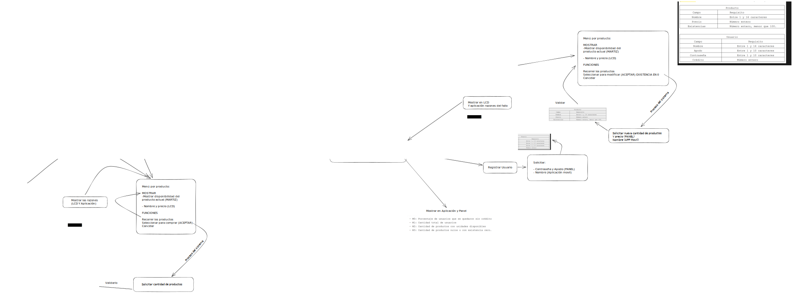
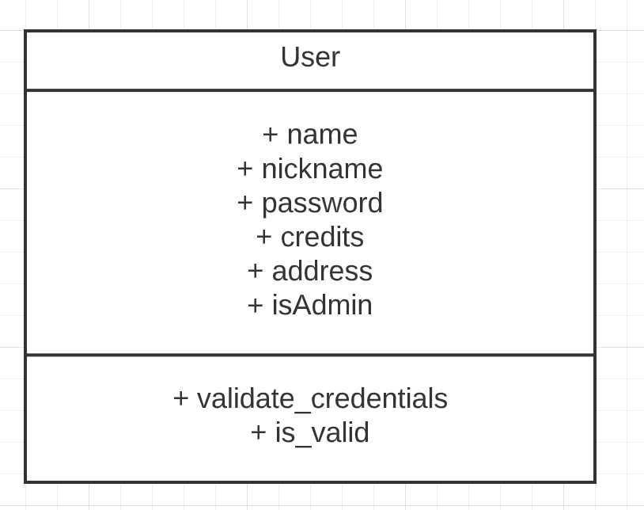
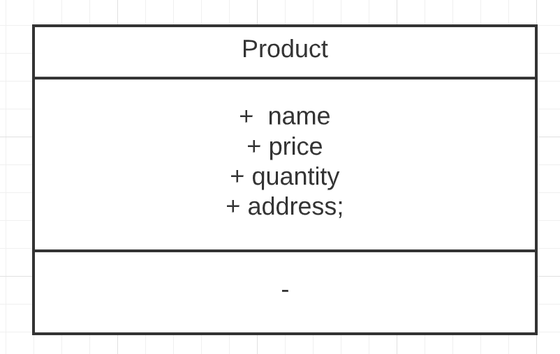
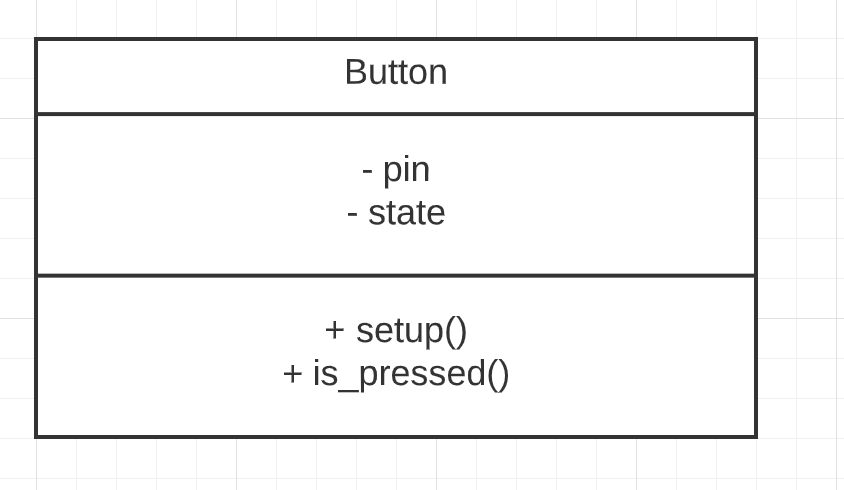
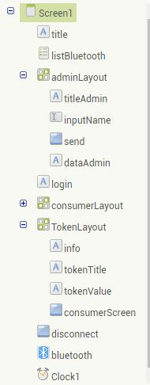
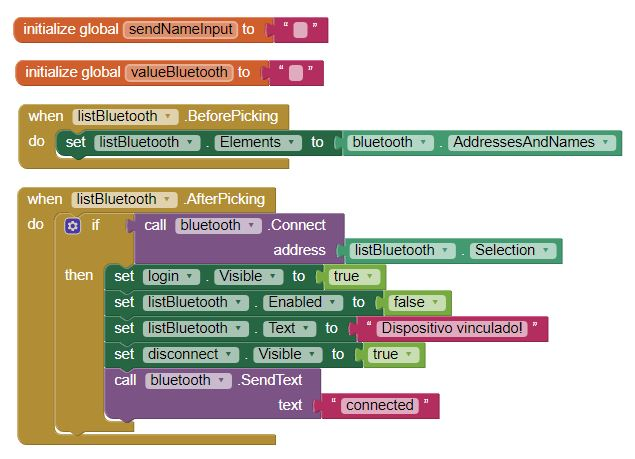
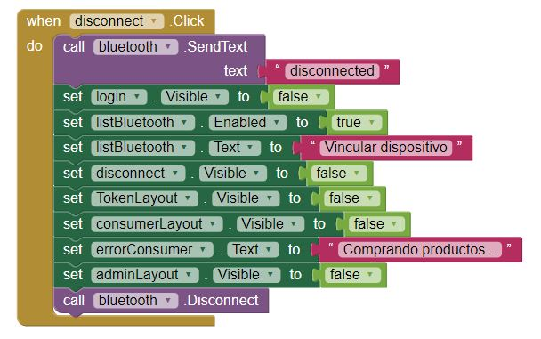
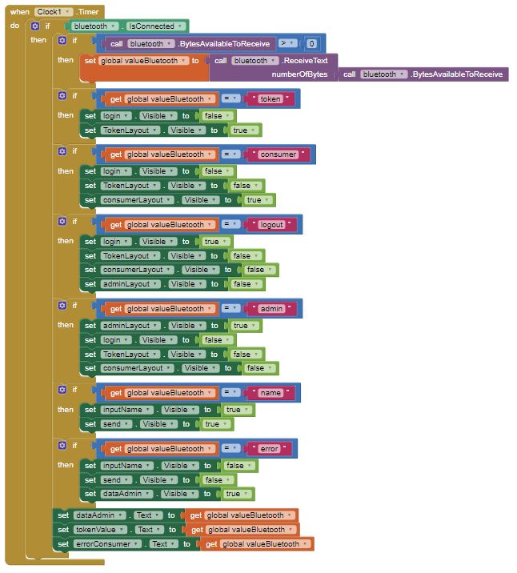
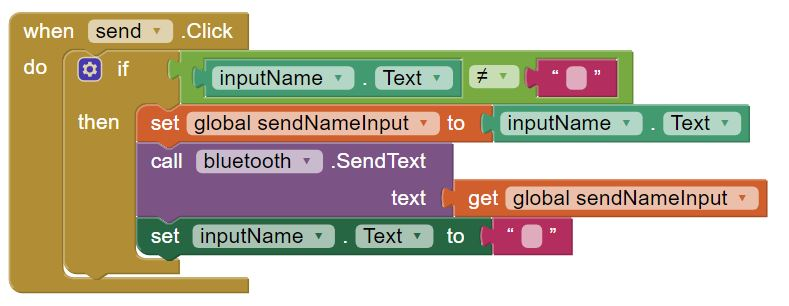

# **Proyecto 1**
### Universidad de San Carlos de Guatemala
### Facultad de Ingeniería
### Escuela de Ciencias y Sistemas
### Arquitectura de Computadores y Ensambladores 1
### Sección B
<br></br>

## **Manual Técnico**
<br></br>

| Nombre | Carnet | 
| --- | --- |
| Daniel Estuardo Cuque Ruíz | 202112145 |
| Damián Ignacio Peña Afre | 202110568 |
| Alvaro Norberto García Meza | 202109567 |
| José Manuel Ibarra Pirir | 202001800 |
----
# **Descripción General**
El proyecto consiste en implementar un modelo de máquina dispensadora a nivel de simulación. La simulación debe considerar varias características para mostrar el desempeño y flujo de ejecución de la máquina de manera cercana a la realidad. El proyecto incluye un diseño inicial proporcionado que se debe implementar utilizando los componentes necesarios y desarrollar una interfaz de usuario para interactuar con la máquina. La interacción debe ser posible a través de un panel de operación colocado en la máquina y una aplicación móvil conectada por Bluetooth.

## **Materiales**
- Arduino Mega 2560
- Bluetooth HC-05
- LCD 16x2
- Teclado Matricial 4x4
- Servomotor
- Buzzer
- 2x LED
- 2x Resistencia 220 Ohm

## **Diagrama de Flujo**


## **Diagrama de Clases**
- User: Esta clase representa todos los usuarios existentes y próximos a ser creados en el sistema. Cuenta con 6 atributos y dos métodos los cuales sirven para validar las credenciales y verificar que el apodo del usuario sea válido. 


- Product: Esta clase representa cada uno de los productos que se encuentran en la máquina dispensadora, dicha clase cuenta únicamente con 4 atributos para almacenar y manejar sus diferentes estados. 


- Button: Esta clase representa y maneja todo los posibles estados de cada uno de los botones utilizados en el sistema, cuenta con dos atributos, uno para saber el pin donde estará conectado y un estado, además cuenta con dos métodos para configurar el pin y modificar el estado cada vez que se presione dicho botón. 


## Manejo de memoria EEPROM
Para el manejo de la memoria EEPROM se trabajó de manera simple desde la primera celda se comienza a guardar datos, primero se guarda cuantos Objetos hay registrados los cuales ocupan 2 bytes luego se guarda la dirección de memoria en la que se insertaría el próximo objeto el cual ocupa también 2 bytes. Luego de este bloque sigue el bloque donde se almacenan los datos donde los productos al ser únicamente 10 se les asignó un espacio por defecto y los usuarios creados cuentan con el espacio restante. 
```C++
const int MAX_MEMORY = 4095;

const int PRODUCT_COUNT_ADDRESS = 0;
const int CURRENT_PRODUCT_ADDRESS = 1 * sizeof(int);
const int PRODUCTS_BLOCK_START_ADDRESS = 2 * sizeof(int);
const int MAX_PRODUCTS = 10;

const int USER_COUNT_ADDRESS = MAX_PRODUCTS * sizeof(Product) + PRODUCTS_BLOCK_START_ADDRESS;
const int CURRENT_USER_ADDRESS = 1 * sizeof(int) + USER_COUNT_ADDRESS;
const int USERS_BLOCK_START_ADDRESS = 2 * sizeof(int) + USER_COUNT_ADDRESS;

// ----------------- FUNCTIONS -----------------

int get_product_count();
void set_product_count(int count);
int get_current_product_address();
void write_product(Product product);
Product get_product(int index);
void update_product(Product product);

int get_user_count();
void set_user_count(int count);
int get_current_user_address();
void write_user(User user);
User get_user(int index);
void update_user(User user);
bool is_user_registered(String username);

```

## Aplicación Móvil
Para lograr la comunicación vía Bluetooth entre el sistema utilizando el driver HC-05 y un teléfono celular, se realizo la aplicación en la plataforma de MIT APP INVENTOR, donde el diseño gráfico de cada interfaz se realizo mediante drag and drop y la programación lógica de cada componente con lógica de programación basada en bloques. 

### Componentes principales 
-	Labels para introducir y modificar textos 
-	Buttons para accionar diferentes funcionalidades 
-	ListPicker para seleccionar entre diferentes opciones
-	Clock para llevar los intervalos de comunicación entre el dispositivo y el sistema
-	BluetoothClient para lograr la comunicación exitosa
- Input para ingresar nombres y enviarlos al sistema 
-	Layouts para mostrar los diferentes estados de la aplicación



### Bloques de código
- Variables globales y selección de dirección de conexión: En los primeros bloques encontramos las variables globales que almacenan toda la información entrante de la comunicación Bluetooth. Luego un bloque para dar lógica al ListPicker y permitir seleccionar una dirección de Bluetooth, el siguiente bloque ejecuta las instrucciones a realizar después de haber seleccionado una dirección, la cual es conectar dicha dirección con el modulo bluetooth y su respectivo Layout. 


- Desconectar bluetooth: Este bloque cumple con la funcionalidad de desvincular el sistema con el dispositivo provocando que los diferentes Layouts no estén visibles y permitiendo nuevamente seleccionar otra dirección de conexión. 


- Datos entrantes y lógicas de Layouts: Este bloque es el más importante de todos ya que al implementar el componente Clock, el cual siempre esta escuchando en un intervalo de tiempo dado, revisa que el dispositivo esté conectado para posteriormente solicitar información entrante y guardarla en su variable global. Dependiendo de la cadena de caracteres entrantes que reciba la aplicación, se accionan diferentes funcionalidades donde la mayoría lo que realizan es hacer visibles ciertos Layouts y ocultar otros. 


- Envio de información: El ultimo bloque captura la cadena de caracteres ingresada en el input y es enviada mediante los bloques lógicos que posee el componente de bluetooth. 



## Movimiento de motores
- Primer Motor Stepper: Dicho motor tiene la funcionalidad de girar un cierto ángulo los 10 compartimentos donde los productos están colocados. Al contar con 10 segmentos y saber que un stepper puede girar 360 grados cada giro entonces conlleva un movimiento de 36 grados el cual muestra un producto diferente, esto funciona tanto para mostrar productos a la izquierda como a la derecha.  

- Segundo Motor Stepper:Este motor tiene la funcionalidad de despachar N cantidad de productos, al momento de ser seleccionado y validado el producto a comprar, este motor acciona una espiral donde están colocados los productos y gira de tal manera que cada vuelta completada es un producto despachado. 