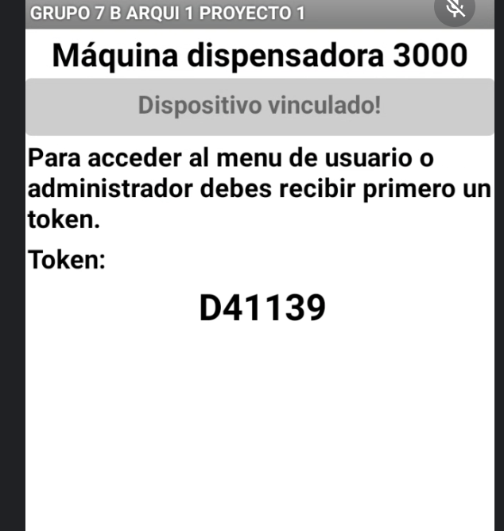
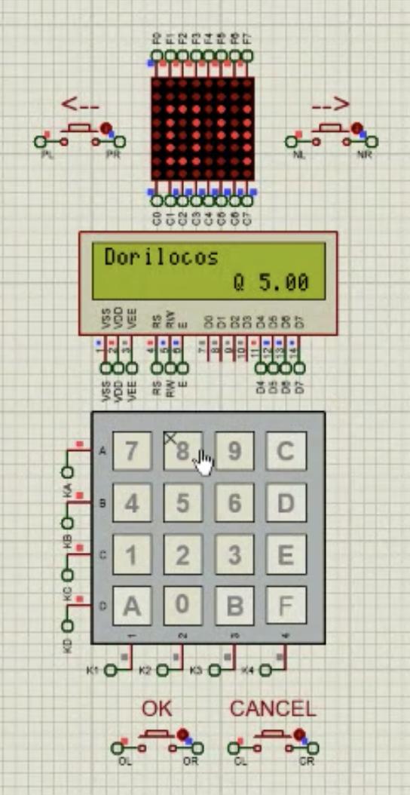

# **Proyecto 1**
### Universidad de San Carlos de Guatemala
### Facultad de Ingeniería
### Escuela de Ciencias y Sistemas
### Arquitectura de Computadores y Ensambladores 1
### Sección B
  

## **Manual de usuario**
  

| Nombre | Carnet | 
| --- | --- |
| Daniel Estuardo Cuque Ruíz | 202112145 |
| Damián Ignacio Peña Afre | 202110568 |
| Alvaro Norberto García Meza | 202109567 |
| José Manuel Ibarra Pirir | 202001800 |
----
# **Descripción General**

## Inicio de sesión para todos los usuarios
Se solicitará que se conecte su dispositivo mediante Bluetooth, para que la aplicación pueda comunicarse con el dispositivo. Una vez conectado, se mostrará el menú principal de la aplicación.
<!-- Imagen de vinculación -->

Al inciar la aplicación, se mostrará un mensaje de bienvenida esperando que se inicie sesión.

De inicio, se mostará el siguiente mensaje:

En la máquina expendedora se solicitará un nickname el cual serán dígitos.

Se solicitará que ingrese su contraseña para poder realizar la compra.

Si no existen suficientes productos en el inventario, se mostrará un mensaje de error en la aplicación

Se pueden seleccionar los productos con los botones de *siguiente* y *anterior*.

Luego de ingresar las credenciales se generará un token el cual será enviado al dispositivo para que pueda realizar la compra.

También se puede presionar el botón de desconectar desde la aplicación móvil para desconectar el dispositivo de la máquina.

Para poder cancelar el menú actual e ir al anterior, se podrá presionar el botón *cancel*.

## **Menú para usuarios**

Habrá varios menús, donde utilizando los botones, se podrá escoger que función realizar. Como por ejemplo:

Luego de terminar la compra, se mostrará la máquina despachando el producto. Junto con un mensaje de compra realizada en la aplicación.

Se tendrá la función para cerrar sesión, la cual estará en la máquina.

## **Menú para administradores**

En la opción de productos, se podrán crear nuevos productos, para abrir ese menú se debe presionar el botón de *ok*.

Al seleccionar se deberá ingresar el nombre del producto, la cantidad y el precio.

El nombre del producto no puede ser nulo, la cantidad debe ser mayor a cero y el precio debe ser mayor a cero.

Para ingresar nuevos usuarios se solicitará un nombre. Que se deberá ingresar desde la aplicación.

También se solicitará la contraseña del usuario. Que se deberá ingresar desde la aplicación.

Así mismo, se podrá asignar un apodo para poder ingresarlo desde la máquina.

También se podrá ver el estado general del sistema mostrando las siguientes métricas:

- M0: Porcentaje de usuarios que se quedaron sin crédito
- M1: Cantidad total de usuarios
- M2: Cantidad de productos con unidades disponibles
- M3: Cantidad de productos nulos o con existencia cero

